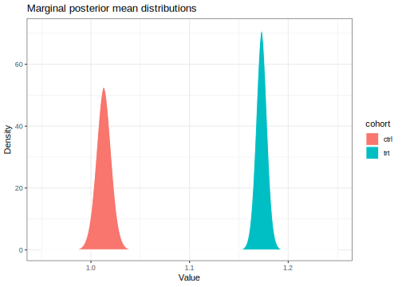

Here's my solution to exercise 3, chapter 3, of
[Gelman's](https://andrewgelman.com/) *Bayesian Data Analysis* (BDA),
3rd edition. There are
[solutions](http://www.stat.columbia.edu/~gelman/book/solutions.pdf) to
some of the exercises on the [book's
webpage](http://www.stat.columbia.edu/~gelman/book/).

<!--more-->
<div style="display:none">

$\DeclareMathOperator{\dbinomial}{Binomial}  \DeclareMathOperator{\dbern}{Bernoulli}  \DeclareMathOperator{\dpois}{Poisson}  \DeclareMathOperator{\dnorm}{Normal}  \DeclareMathOperator{\dt}{t}  \DeclareMathOperator{\dcauchy}{Cauchy}  \DeclareMathOperator{\dexponential}{Exp}  \DeclareMathOperator{\dgamma}{Gamma}  \DeclareMathOperator{\dinvgamma}{InvGamma}  \DeclareMathOperator{\invlogit}{InvLogit}  \DeclareMathOperator{\logit}{Logit}  \DeclareMathOperator{\ddirichlet}{Dirichlet}  \DeclareMathOperator{\dbeta}{Beta}$

</div>

Suppose we have $n$ measurements
$y \mid \mu, \sigma \sim \dnorm(\mu, \sigma)$, where the prior
$p(\mu, \log \sigma) \propto 1$ is uniform. The calculations on page 66
show that the marginal posterior distribution of $\mu$ is
$\mu \mid y \sim \dt(\bar y, s / n)$, where $s$ is the sample standard
deviation.

``` {.r}
control <- list(
  n = 32,
  mean = 1.013,
  sd = 0.24
)

treatment <- list(
  n = 36,
  mean = 1.173,
  sd = 0.2
)
```

``` {.r}
library(LaplacesDemon)

tibble(value = seq(0.95, 1.25, 0.001)) %>% 
  mutate(
    ctrl = dst(value, control$mean, control$sd / control$n, control$n - 1),
    trt = dst(value, treatment$mean, treatment$sd / treatment$n, treatment$n - 1),
  ) %>% 
  gather(cohort, density, ctrl, trt) %>% 
  ggplot() +
  aes(value, density, fill = cohort) +
  geom_area(colour = 'white') +
  labs(
    x = 'Value',
    y = 'Density',
    title = 'Marginal posterior mean distributions'
  )
```



``` {.r}
draws <- 10000

tibble(draw = 1:draws) %>% 
  mutate(
    ctrl = rst(n(), control$mean, control$sd / control$n, control$n - 1),
    trt = rst(n(), treatment$mean, treatment$sd / treatment$n, treatment$n - 1),
    difference = trt - ctrl
  ) 
```

    # A tibble: 10,000 x 4
        draw  ctrl   trt difference
       <int> <dbl> <dbl>      <dbl>
     1     1  1.02  1.18      0.158
     2     2  1.01  1.17      0.163
     3     3  1.00  1.18      0.181
     4     4  1.01  1.17      0.160
     5     5  1.01  1.17      0.151
     6     6  1.02  1.17      0.157
     7     7  1.02  1.16      0.140
     8     8  1.02  1.17      0.154
     9     9  1.01  1.18      0.167
    10    10  1.01  1.17      0.156
    # ... with 9,990 more rows
