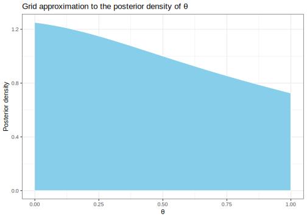
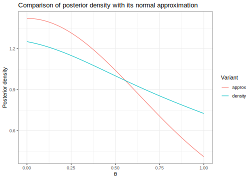

Here's my solution to exercise 1, chapter 4, of
[Gelman's](https://andrewgelman.com/) *Bayesian Data Analysis* (BDA),
3rd edition. There are
[solutions](http://www.stat.columbia.edu/~gelman/book/solutions.pdf) to
some of the exercises on the [book's
webpage](http://www.stat.columbia.edu/~gelman/book/).

<!--more-->
<div style="display:none">

$\DeclareMathOperator{\dbinomial}{Binomial}  \DeclareMathOperator{\dbern}{Bernoulli}  \DeclareMathOperator{\dpois}{Poisson}  \DeclareMathOperator{\dnorm}{Normal}  \DeclareMathOperator{\dt}{t}  \DeclareMathOperator{\dcauchy}{Cauchy}  \DeclareMathOperator{\dexponential}{Exp}  \DeclareMathOperator{\duniform}{Uniform}  \DeclareMathOperator{\dgamma}{Gamma}  \DeclareMathOperator{\dinvgamma}{InvGamma}  \DeclareMathOperator{\invlogit}{InvLogit}  \DeclareMathOperator{\dinvchi}{InvChi2}  \DeclareMathOperator{\dnorminvchi}{NormInvChi2}  \DeclareMathOperator{\logit}{Logit}  \DeclareMathOperator{\ddirichlet}{Dirichlet}  \DeclareMathOperator{\dbeta}{Beta}$

</div>

Suppose the likelihood is Cauchy,
$p(y_i \mid \theta) \propto (1 + (y_i - \theta)^2)^{-1}$, with a prior
uniform on $[0, 1]$. Then the posterior has the same equation as the
likelihood on the support of $\theta$. Part of the exercise is to find
the posterior mode but the hint is more confusing than helpful. Solving
for the mode algebraically involves solving a polynomial of degree
$2n + 1$, where $n$ is the number of observations. We'll use some
numerical approximations to find the mode.

Posterior mode
--------------

The observed data are as follows.

``` {.r}
y <- c(-2, -1, 0, 1.5, 2.5)
```

We could make draws from the posterior by coding this up in stan.
However, an estimation of the mode from such values is difficult. An
alternative is to use numerical optimisation. For that we'll use the
posterior on the log scale.

``` {.r}
log_likelihood <- function(y, theta)
  (1 + (y - theta)^2) %>% 
    log() %>% 
    sum() %>% 
    map_dbl(`*`, -1)

log_posterior_given <- function(y) {
  function(theta) {
    if (theta < 0 | 1 < theta) {
      return(-Inf)
    } else {
      return(log_likelihood(y, theta))
    }
  }
}

log_posterior <- log_posterior_given(y)
```

Numerical maximisation gives us a value near, but not quite, zero.

``` {.r}
mode_numerical <- optimise(log_posterior, c(0, 1), maximum = TRUE)$maximum
mode_numerical
```

    [1] 6.610696e-05

Let's plot the posterior.

``` {.r}
granularity <- 1e5
grid <- tibble(theta = seq(0, 1, length.out = granularity)) %>% 
  mutate(
    id = 1:n(),
    log_unnormalised_density = map_dbl(theta, log_posterior),
    unnormalised_density = exp(log_unnormalised_density),
    density = granularity * unnormalised_density / sum(unnormalised_density),
    is_mode = abs(theta - signif(mode_numerical, digits = 1)) < 0.5 / granularity
  ) 
```



Indeed, it looks like the mode could be 0. Zooming in we see that it is
very likely to be zero.


``` {.r}
mode <- 0
```

Normal approximation
--------------------

Now let's calculate the derivatives in order to find the normal
approximation. The derivative of the log posterior is

$$
\frac{d}{d\theta} \log p(y \mid \theta)
=
2 \sum_1^5 \frac{y_i - \theta}{1 + (y_i - \theta)^2}
.
$$

The second derivative of the log posterior is

$$
\begin{align}
\frac{d^2}{d\theta^2} \log p(y \mid \theta)
&=
\sum_1^5
\frac{
  \frac{-2}{1 + (y_i - \theta)^2} - \frac{2(y_i - \theta)}{(1 + (y_i - \theta)^2)^2}\cdot 2(y_i - \theta)
}{
  \left( 1 + (y_i - \theta)^2 \right)^2
}
\\
&=
\sum_1^5
\frac{-2\left( 1 + (y_i - \theta)^2 \right)^2 - 4 (y_i - \theta)^2}{\left( 1 + (y_i - \theta)^2 \right)^4}
\\
&=
-2
\sum_1^5
\frac{3(y_i - \theta)^2 + 2(y_i - \theta) + 1}{\left( 1 + (y_i - \theta)^2 \right)^4}
.
\end{align}
$$

Evaluating this at the mode gives

$$
-2 \sum_1^5 \frac{3y_i^2 + 2y_i + 1}{\left( 1 + y_i^2 \right)^4}
.
$$

The means that the observed information is

``` {.r}
I <- 2 * sum((3 * y^2 + 2 * y + 1) / (1 + y^2)^4)
I
```

    [1] 2.489427

This gives us the normal approximation with

``` {.r}
mu <- mode
variance <- 1 / I
std <- sqrt(variance)

c(mu, std)
```

    [1] 0.0000000 0.6337972

which gives us the normal approximation
$p(\theta \mid y) \approx \dnorm(0, 0.634)$ on $[0, 1]$.



The approximation isn't very good.
